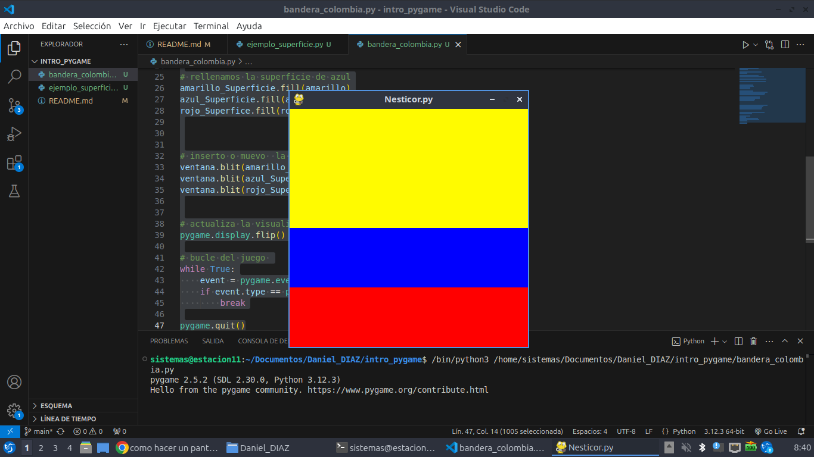

# Estructura de un juego en pygame

## inicialización
 - como todo programa en python, se deben importar los modulos o librerias a utilizar 

```import pygame```

- inicializar pygame usando la función init(). inicializa todos los modulos de pygame importados.

```pygame.init```

## visualizacion de la ventana 

```ventana = pygame.display.set_mode((600,400))```

- set_mode es la funcion encargada de definir el tamaño de la ventana. En el ejemplo, se esta definiendo una ventana de 600 px de ancho, 400 px de alto.

`pygame.display.set_caption("mi ventana)`
- set_caption es la funcion que añade  un titulo a la ventana.

### funcion set_mode
`set_mode(size =(o,o), flags = 0, deph = 0,      display = 0)`

- size =(600,400) : define el tamaño de la ventana.

- flags: define uno o mas comportamientos para la ventana.
    - valores
        - pygame.FULLSCREEN
        - pygame.RESIZAVLE
    
    
    - ejemplo
        - flags = pygame.FULLSCREEN | pygame.RESIZABLE: pantalla completa.
        dimensiones modificables.


## bucle del juego - game loop 

- bucle infinito que se interrumpira al cumplir ciertos criterios 

- reloj interno del juego 

- en cada iteracion del bucle del juego podemos mover a un personaje, o tener en cuenta que un objeto a alcanzado a otro o que se cruzo la linea de llegada, lo que quiere decir que la partida termino.

- cada iteracion es una oportunidad para actualizar todsos los datos relacionados con el estado actual de la partida.

- en cada iteracion se realizan las siguientes tareas:
    1. comprbar que no se alcanzan las condiciones de parada, en cuyo caso se interrumpe el bucle.
    
    2. actualizar los recursos necesarios para la interacion actual.
    
    3. obtener las entradas del sistema, o de interaccion con el jugador.
    
    4. actualizar todas las entidades que caracterizan el juego.
    
    5. refrescar la pantalla


## superficies pygame

- superficie: 
    - elemento geometrico.
    - linea, poligono, imagen, texto que se muestra en la pantalla 
    - el poligono se puede o no rellenar de color. 
    - las superficies se crean de diferente manera dependiendo del tipo:
        - imagen: image.load() 
        - texto: font.render()
        - superficie generica: pygame.surface()
        - ventana del juego: pygamen.display.set_mode()


# Ejemplo bandera_colombia
``` # importamos la libreria pygamme
import pygame 

# inicializamos los modulos de pygame
pygame.init()

# establecer titulo a la ventana
pygame.display.set_caption("Nesticor.py")

# establecemos las dimenciones de la ventana 

ventana = pygame.display.set_mode((400,400))


# definnimmos un color 
amarillo = (255, 251, 0)
azul = (0, 0, 255)
rojo = (255, 0, 0)

# crear una superficie 
amarillo_Superficie = pygame.Surface((400,200))
azul_Superficie = pygame.Surface((400,100))
rojo_Superfice = pygame.Surface((400,100))

# rellenamos la superficie de azul
amarillo_Superficie.fill(amarillo)
azul_Superficie.fill(azul)
rojo_Superfice.fill(rojo)


# inserto o muevo  la superficie de la ventana 
ventana.blit(amarillo_Superficie, (0,0))
ventana.blit(azul_Superficie, (0,200))
ventana.blit(rojo_Superfice, (0,300))


# actualiza la visualizacion de la ventana
pygame.display.flip()

# bucle del juego 
while True:
    event = pygame.event.wait()
    if event.type == pygame.QUIT:
        break

pygame.quit() 
```

    
## gestion de tempo y los eventos

### modulo time 
- este modulo ofrece varias funciones que permiten cronometrar la sesion actual desde el init() o pausar la ejecusion por ejemplo.
- funciones:
    - pygame.time.get ticks
    - oygame.time.type.time.delay

- objeto clock
    - la duncion tick permite actualizarel reloj asociado con el juego actual.
    - se llama cada vez que se actualiza la pantalla del juego.
    - permite especificar el numero maximo de fotogramas que se  muestran por segundo y por tanto, limitar y controlar la velocidad de ejecucion del juego.
    - si insertamos en un bule de juego la siguiente linea, garantizamos que nunca se ira mas rapido de 50 fotogramas por segundo: `clock.tick(50)`

### gestion de eventos 
- hay diferentes formas que el programa sepa que se ha desencadenado un evento.
- es escencial que los programas puedan conocer inmediatamente las acciones del jugador a travez del teclado, el mause, joystick o cualquer otro periferico.

#### funcion pygame.event.get

- permite obtener todos los eventos en espera de ser procesados y que estan disponibles en una cola.
- si no hay ninguno, entonces se obtiene una coleccion vacia.

```python

# usamos un bucle for para recorrer todos los eventos de la coleccion obtenida al llamar la funcion get

for event in pygame.event.get():
    if event.type == pygame.KEYDOWN:
        if event.key == pygame.K ESCAPE:
            PARAR JUEGO = True 
```

#### Funcion pygame.event.wait
- esta funcion espera que ocurra un evento, y en cuanto sucede esta disponible.

```python

while True:
    event = pygame.event.wait()
    if event.type == pygame.QUIT:
        break
    
```
#### Funcion pygame.event.poll
- devuelve solo uno de los eventos que estan en la cola de espera 

## sonidos en pygame
- pygame.mixer: modulo que permite la gestion del sonido.
- music:submodulo que gestiona la musica de fondo. necesariamente solo hay uno a la vez
- sound: objeto de mixer, que se puede distanciar varias vecespara usar en los efectos de sonido dle juego.


### archivos de sonido 
- se recomienda usar dos formatos principalmente:
    - formato wav wavetorn audio file format.
    - formato abierto y gratuito ogg

### channe (canal) enpygame
- un juego tiene varios canales de sonido. 
- se puede asignar un sonido al canal numero 1 y otro diferente al numero 2.
- entonces es posible reproducir sonidos simultaneamente activando su lectura en diferenes canales.

## sprites
- objeto que asocia una ubicacion, una representacion grafic(esta o aquella y imagen, por ejemplo y un conjunto de propiedades).
- estas propiedades  puede ser un nombre, un texto, valores boolneados que caracterizan el objeto en cuestion (por ejemplo si el objeto se puede mover o no)

- lina posibletraduccion del termino sprite podria ser "imagen.objeto" que se actualiza con cada interacion del bicle del juego.
- cuanto mas complejo es el juego, mas on¿bjetos graficos tiene que gesionar y actualizar, lo que puede ser tedioso.
- pygame usa no solo la nocion de sprite, sino  de grupo de sprites (group)
ejercito, lo que se entiende como una coleccion de instancias de una clase saldada.
- un determinado procesamiento se puede aplicar a un onjunto a subconjunto de sprites. ejemplo: cambiar el color de todos los enemigos o hacer invisibles algunos objetos. 


